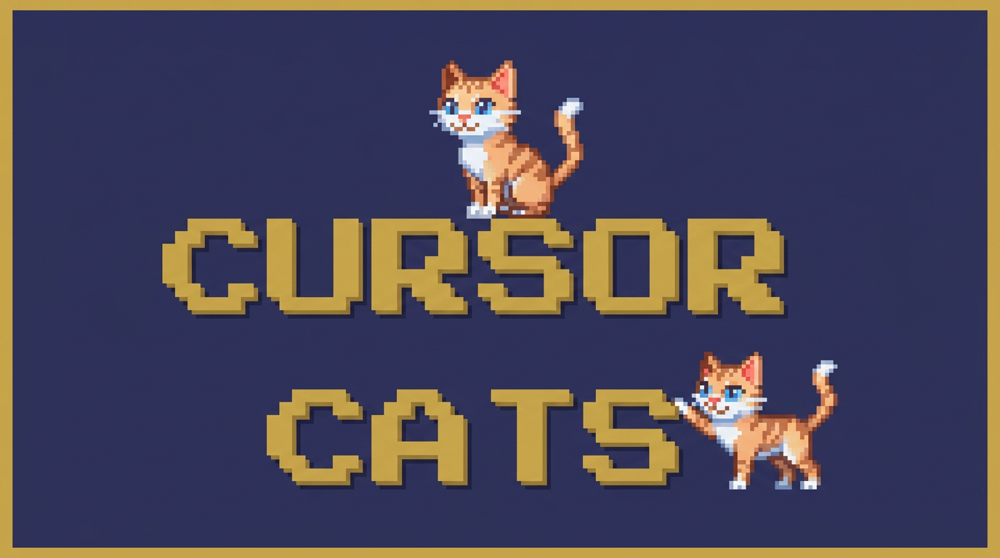

<p align="center">
  
</p>

Write code with your Cursor Cats, little pixel familiars on your desktop. One cat per run, prowling on top of every window, purring until the task lands, while occasionally fighting with eachother. Click a cat to read its conversation or to see its final message. CMD+Shift+S to launch a new cat.

## Powered by the Cursor SDK

Cursor Cats are powered by the Cursor SDK. Spawning a local cat from the modal creates an [`@cursor/sdk`](https://www.npmjs.com/package/@cursor/sdk) `Agent` rooted at the folder you pick, with Cursor-like project, user, team, and plugin settings enabled so the run can use that workspace's rules and skills.

Cloud cats use Cursor's cloud agent runtime instead. Choose **Cloud**, pick one of your Cursor-connected GitHub repositories, and optionally enter a starting ref. Cloud runs use `autoCreatePR: true`, so code-changing runs open a PR when Cursor returns git metadata.

## Installation

**Run once without installing** (downloads the repo, runs `prepare`, then launches):

```bash
npx github:fieldsphere/cursor-cats
```

**Install globally** so `cursorcats` is on your `PATH`:

```bash
npm install -g github:fieldsphere/cursor-cats
cursorcats
```


## Usage

- **Add Cursor API key** to your env:
```bash
export CURSOR_API_KEY=your_key
cursorcats
```
- **Launch**: `cursorcats` (or `npx github:fieldsphere/cursor-cats`).
- While the app is running, use **Cmd+Shift+C** (macOS) or **Ctrl+Shift+C** (Windows/Linux) to add a new Cursor Cat.
- **Local runs**: choose a folder on disk. Finished local cats can revert changes back to the folder snapshot captured when the cat spawned.
- **Cloud runs**: choose a connected repository from the Cloud tab. Finished cloud cats show returned branch/PR links in the conversation window; local revert is not available for cloud runs.
